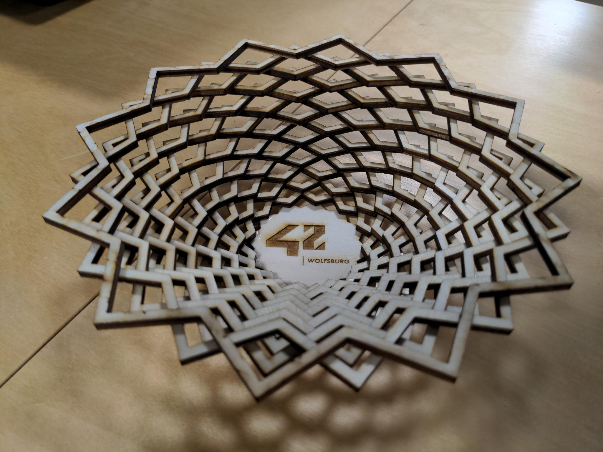

# Wooden Bowl

## How to build
1. Open `bowl.scad` with [OpenSCAD](https://openscad.org)
2. Use `preview()` to see how the finished bowl would look. Adjust the parameters until you're
   happy with it.
3. Render `stencil()` and export it as SVG.
4. Use `glue_areas()` if you want engravings where the glue goes. This helps with assembly.
   (Optional)
5. Cut wood with laser cutter, using SVG file.
6. Apply wood glue and assemble layer by layer.
